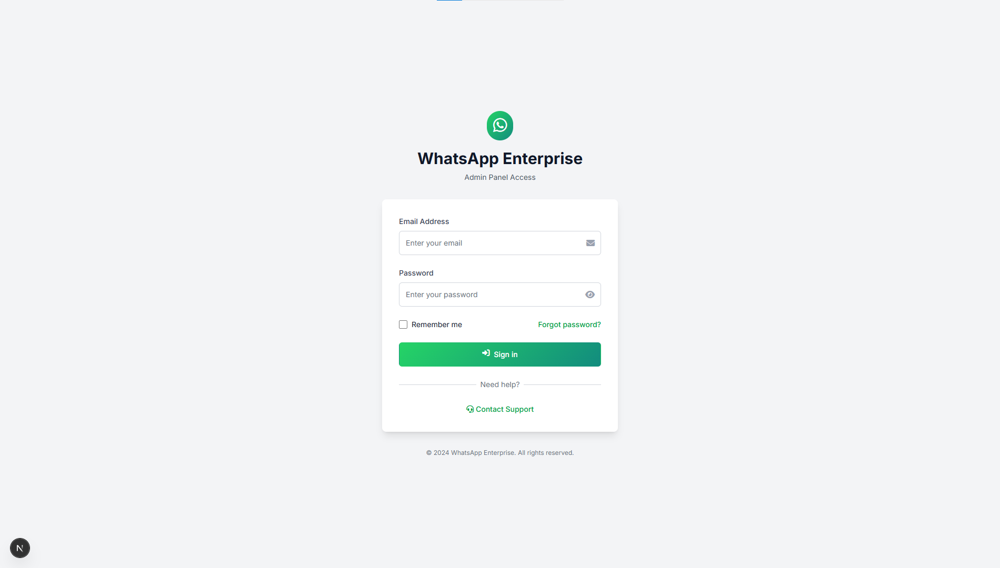
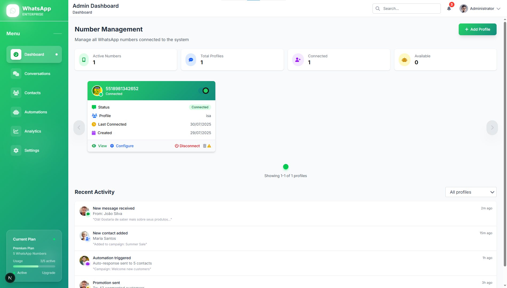
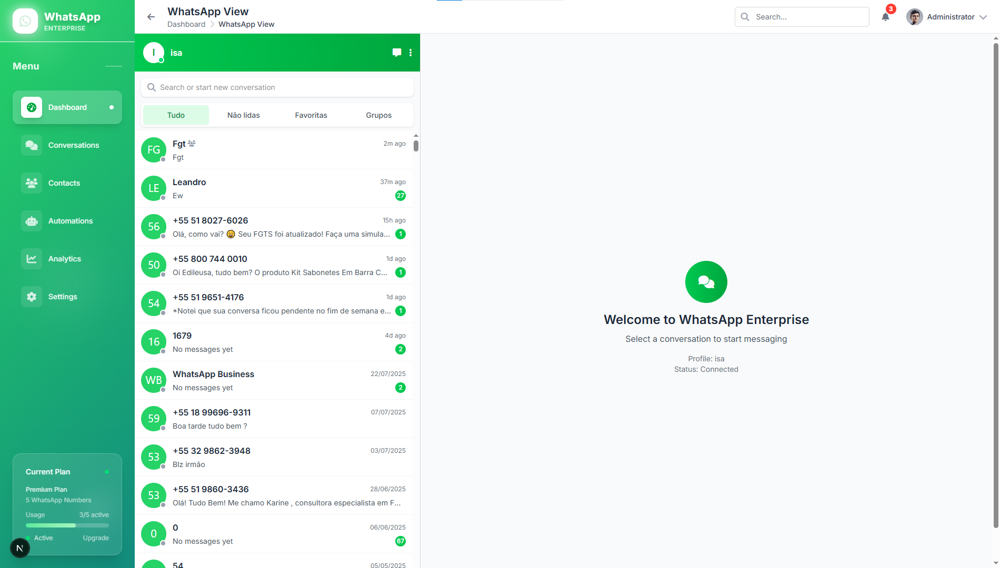
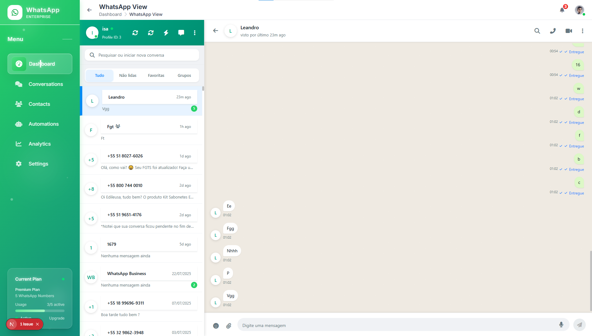
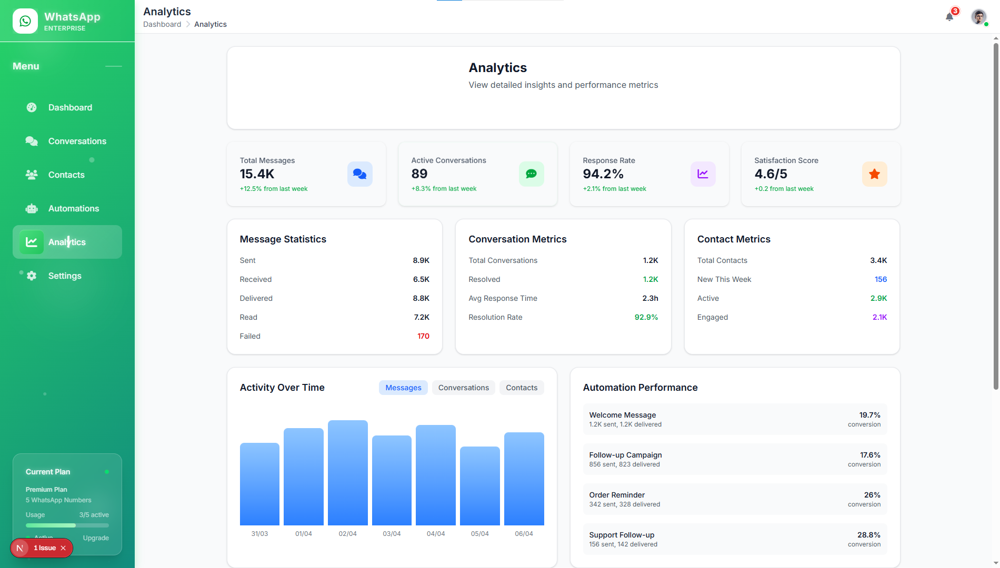
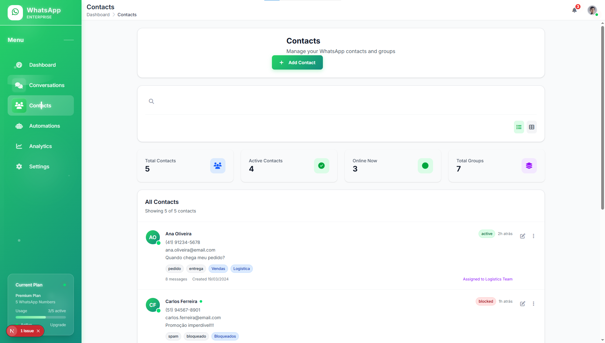
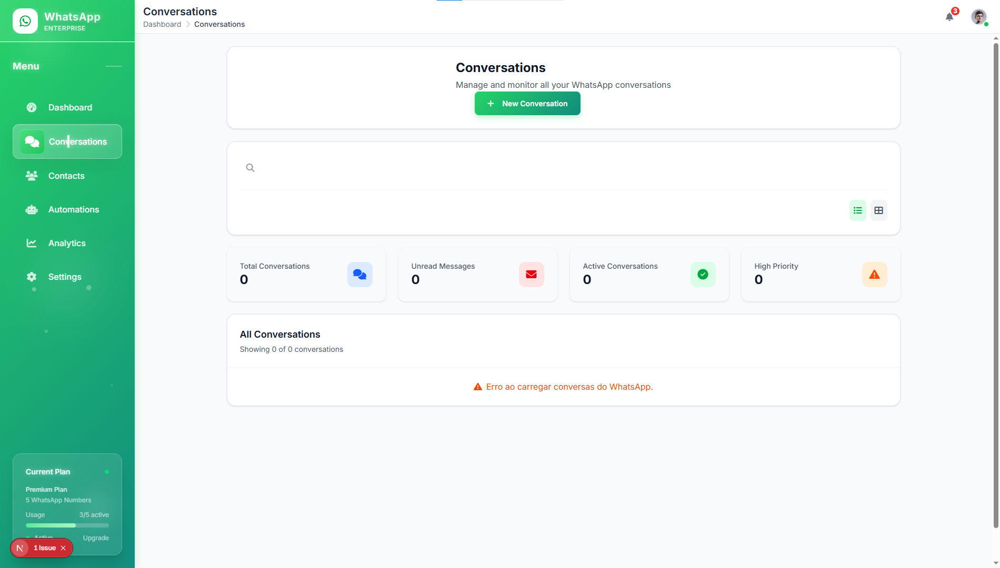
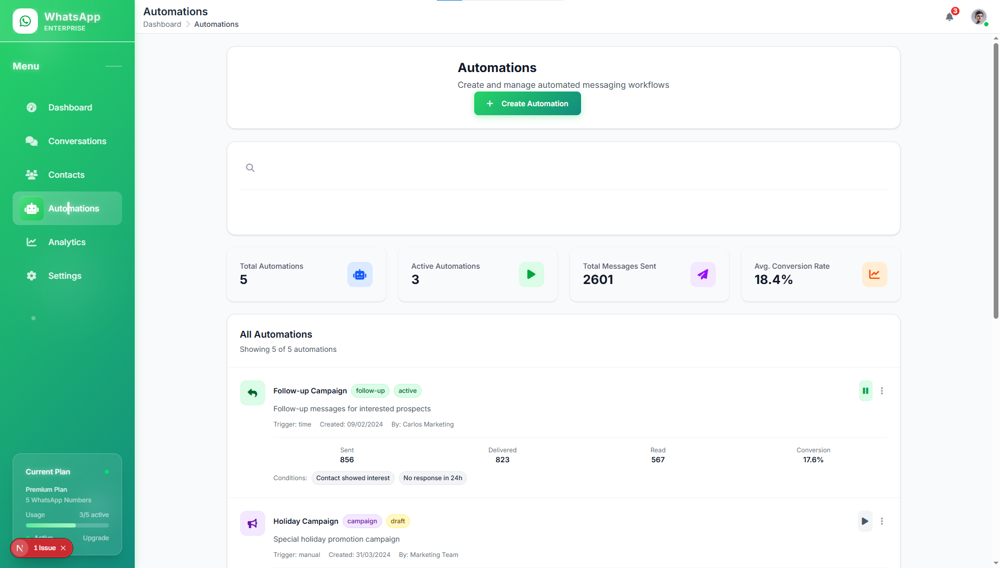
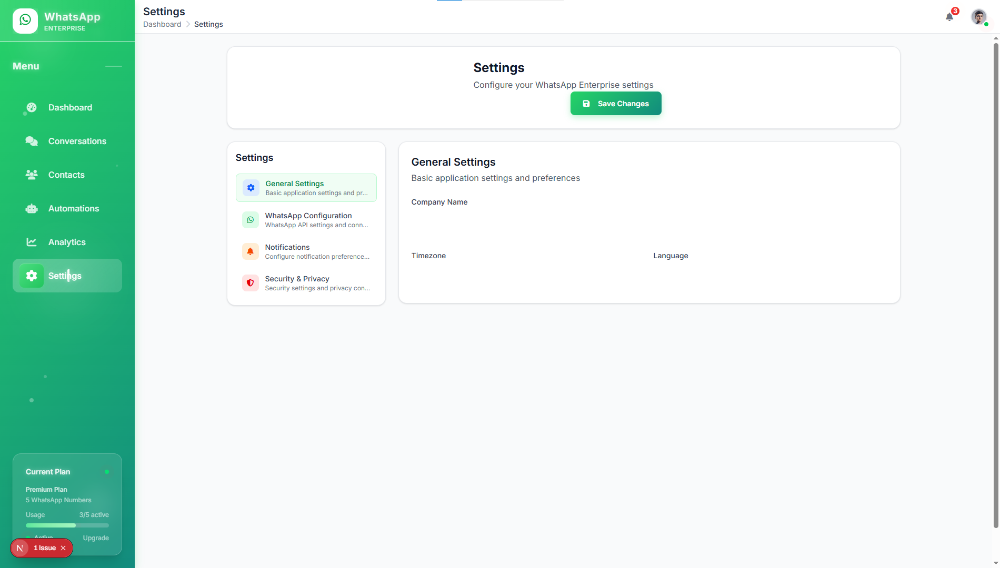

# 📱 WhatsApp Enterprise

> **Intelligent WhatsApp Management System for Businesses**

> **⚠️ Status: In Development - Not all features are available. Contact us for questions!**

A modern web platform that transforms WhatsApp into a powerful business tool, offering automation, artificial intelligence, and a complete administrative interface.

[](LICENSE)
[](https://www.typescriptlang.org/)
[](https://nextjs.org/)
[](https://nodejs.org/)
[](https://github.com/leandrosuza/whatsapp-enterprise)

## 📋 Table of Contents

- [🚀 About the Project](#-about-the-project)
- [✨ Available Features](#-available-features)
- [🛠️ Technologies](#️-technologies)
- [⚡ Quick Start](#-quick-start)
- [📱 Screenshots](#-screenshots)
- [🔐 Security](#-security)
- [📞 Contact](#-contact)
- [📄 License](#-license)

## 🚀 About the Project

**WhatsApp Enterprise** is a complete solution that combines:

- **🔄 Intelligent Automation** with integrated AI
- **📊 Advanced Management** of leads and conversations
- **📨 Bulk Messaging** with multiple numbers
- **🎨 Modern Interface** fully responsive
- **🔒 Robust Authentication System** secure and reliable
- **🤖 WhatsApp Integration** with Web.js
- **👥 WhatsApp Profile Management**
- **📈 Analytics** and real-time reports
- **💬 Chat Interface** similar to WhatsApp Web
- **🔍 Intelligent Filter System**

## ✨ Available Features

### ✅ Implemented (v1.0.0)

#### 🔐 Authentication System
- Secure JWT login
- Role-based protection middleware
- Rate limiting and CORS configured
- Input validation on all routes

#### 🎨 Administrative Interface
- Modern and responsive design
- Reusable components
- Smooth animations and visual effects
- Mobile First with optimized navigation
- Glass morphism and modern gradients

#### 🤖 WhatsApp Integration
- Connection with WhatsApp Web.js
- Multiple profile management
- QR Code for authentication
- Real-time connection status
- Scheduled message sending

#### 👥 Profile Management
- WhatsApp profile creation and editing
- Association with system users
- Connection history
- Custom configurations

#### 💬 Chat Interface (NEW!)
- Interface similar to WhatsApp Web
- Advanced filter system (All, Unread, Favorites, Groups)
- Visual indicators for groups
- Fixed input area at the bottom
- Automatic scroll to recent messages
- Support for different message types
- Mocked data for testing

#### 📊 Analytics Dashboard (NEW!)
- Real-time metrics dashboard
- Message statistics
- Performance analytics
- Data visualization

#### 👥 Contact Management (NEW!)
- Contact database management
- Contact photo handling
- Contact categorization
- Import/export functionality

#### 💬 Conversation Management (NEW!)
- Conversation history
- Message threading
- Conversation status tracking
- Search and filter conversations

#### ⚙️ Settings Panel (NEW!)
- System configuration
- User preferences
- Profile settings
- Security settings

#### 🤖 Automation System (NEW!)
- Automated response system
- Campaign automation
- Trigger-based actions
- Workflow management

## 🛠️ Technologies

### Frontend
- **Next.js 15** - React framework with SSR
- **TypeScript** - Static typing
- **Tailwind CSS 4** - Utility CSS framework
- **Socket.IO Client** - Real-time communication
- **@tanstack/react-query** - Data fetching and caching
- **Zustand** - State management
- **NextAuth.js** - Authentication

### Backend
- **Node.js** - JavaScript runtime
- **Express.js** - Web framework
- **TypeScript** - Static typing
- **SQLite** - Database
- **Socket.IO** - WebSockets
- **Sequelize** - ORM

### WhatsApp Integration
- **whatsapp-web.js** - WhatsApp Web.js library
- **Puppeteer** - Browser automation

### Authentication & Security
- **JWT** - JSON Web Tokens
- **bcrypt** - Password hashing
- **CORS** - Cross-Origin Resource Sharing
- **Rate Limiting** - Spam protection
- **Helmet** - Security headers

### AI & Automation
- **OpenAI** - AI integration
- **Node-cron** - Scheduled tasks

## ⚡ Quick Start

### 1. Quick Installation

```bash
# Clone the repository
git clone https://github.com/leandrosuza/whatsapp-enterprise.git
cd whatsapp-enterprise

# Install dependencies
npm run install:all

# Setup environment
npm run setup:env

# Create admin user
cd backend && npm run create-admin

# Start the project
npm run dev
```

### 2. Access the System

- **URL:** `http://localhost:3000/admin/login`
- **Email:** `admin@gmail.com`
- **Password:** `admin123`

### 3. WhatsApp Configuration

1. Login to the administrative system
2. Create a new WhatsApp profile
3. Scan the QR Code with your WhatsApp
4. Wait for the connection to be established
5. Access the chat interface

## 📱 Screenshots

### 🏠 Login Screen


### 📊 Administrative Dashboard


### 👤 WhatsApp Profile Opened


### 💬 Chat Interface


### 📊 Analytics Dashboard


### 👥 Contact Management


### 💬 Conversation Management


### 🤖 Automation System


### ⚙️ Settings Panel


## 🔐 Security

- **Encrypted passwords** with bcrypt
- **JWT tokens** with expiration
- **Rate limiting** and CORS configured
- **Input validation** on all routes
- **Role-based protection middleware**
- **Secure WhatsApp sessions**
- **Data sanitization** on all requests
- **Security headers** with Helmet
- **Compression** for performance
- **Request logging** with Morgan

## 📞 Contact

### ⚠️ Support and Questions

**Current Status:** Active development

- **Email:** leandrodsl2004@gmail.com
- **GitHub Issues:** [Report Bug](https://github.com/leandrosuza/whatsapp-enterprise/issues)

### 🤝 Contributing

1. Fork the project
2. Create a feature branch (`git checkout -b feature/AmazingFeature`)
3. Commit your changes (`git commit -m 'Add some AmazingFeature'`)
4. Push to the branch (`git push origin feature/AmazingFeature`)
5. Open a Pull Request

### ⭐ If this project helped you, consider giving it a star!

[](https://github.com/leandrosuza/whatsapp-enterprise)

## 📄 License

Custom License - see the [LICENSE](LICENSE) file for details.

**⚠️ Important:** This project is open source for educational and non-commercial use. Commercial use requires explicit written permission from the author. See LICENSE file for full terms and conditions.

**⚠️ Important:** This project is open source for educational and non-commercial use. Commercial use requires explicit written permission from the author. See LICENSE file for full terms and conditions.

---

**Developed with ❤️ to revolutionize business communication**

> **⚠️ Reminder:** This project is under active development. Features may be added, modified, or removed without prior notice.
