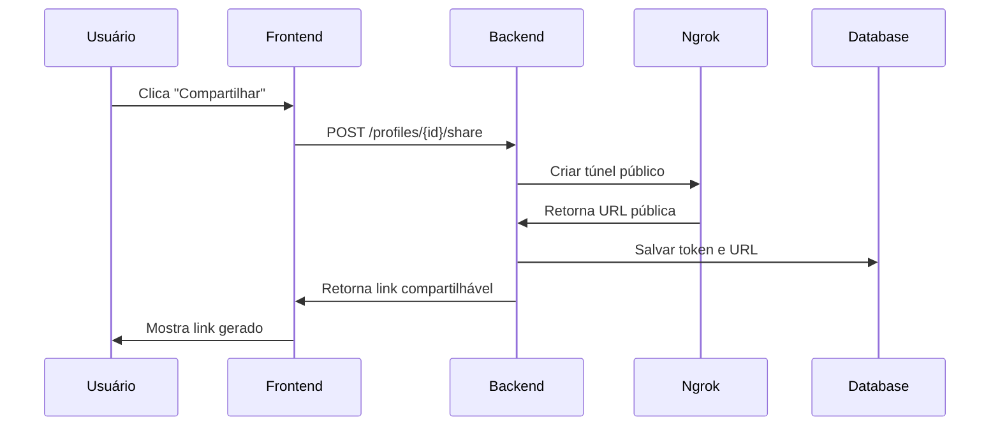
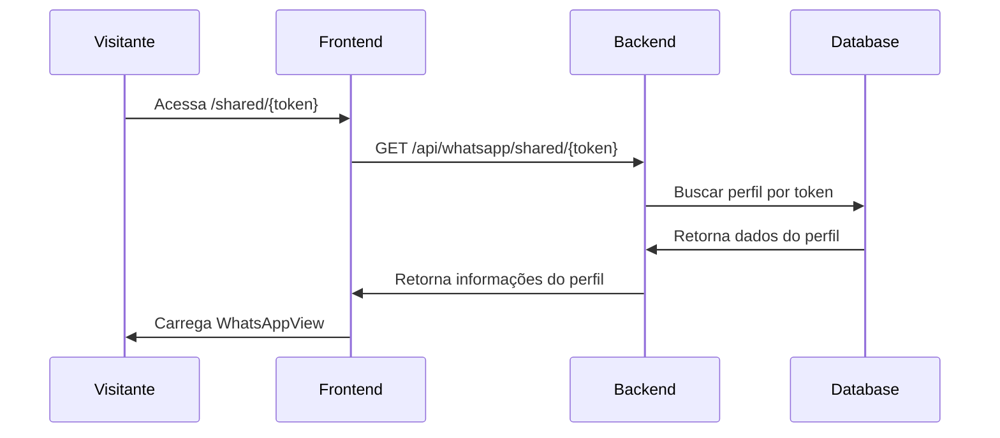

# 🔗 Sistema de Compartilhamento de Perfis WhatsApp

## 📋 Visão Geral

O sistema de compartilhamento permite criar links públicos para acessar perfis específicos do WhatsApp em páginas dedicadas, sem necessidade de login ou layout externo.

## ✨ Funcionalidades

- **Links Públicos**: URLs únicas para cada perfil
- **Páginas Dedicadas**: Interface limpa sem layout administrativo
- **Ativação/Desativação**: Controle total sobre o compartilhamento
- **Tokens Seguros**: Identificadores únicos para cada link
- **Ngrok Integration**: URLs públicas automáticas
- **Responsivo**: Funciona em qualquer dispositivo

## 🚀 Como Usar

### 1. Ativar Compartilhamento

1. Acesse o **Dashboard** do sistema
2. Localize o perfil desejado
3. Clique no botão **🔗 Compartilhar link de acesso**
4. No modal, ative o **toggle de compartilhamento**
5. Aguarde a geração do link

### 2. Compartilhar o Link

- **Copiar Link**: Clique no botão de copiar
- **Abrir Link**: Clique em "Abrir Link" para testar
- **Compartilhar**: Envie o link para quem precisa acessar

### 3. Acessar Perfil Compartilhado

- Abra o link em qualquer navegador
- A página carrega automaticamente o WhatsApp do perfil
- Interface limpa e focada nas conversas

## 🔧 Configuração Técnica

### Backend

1. **Instalar dependências**:
   ```bash
   cd backend
   npm install
   ```

2. **Executar migração**:
   ```bash
   npm run add-sharing-fields
   ```

3. **Configurar Ngrok** (opcional):
   ```bash
   # Instalar ngrok globalmente
   npm install -g ngrok
   
   # Configurar token (opcional)
   export NGROK_AUTH_TOKEN=seu_token_aqui
   ```

### Frontend

1. **Estrutura de arquivos**:
   ```
   frontend/src/app/
   ├── shared/[token]/page.tsx          # Página compartilhada
   └── api/whatsapp/shared/[token]/     # API route
   ```

2. **Variáveis de ambiente**:
   ```env
   NEXT_PUBLIC_API_URL=http://localhost:3001
   ```

## 📊 Campos do Banco de Dados

### Tabela: `whatsapp_profiles`

| Campo | Tipo | Descrição |
|-------|------|-----------|
| `is_shared` | BOOLEAN | Se o perfil está compartilhado |
| `share_token` | VARCHAR(255) | Token único do link |
| `share_url` | TEXT | URL completa do compartilhamento |
| `shared_at` | DATETIME | Data/hora da ativação |

## 🔐 Segurança

### Tokens Únicos
- Cada perfil gera um token único de 32 caracteres
- Tokens são criptograficamente seguros
- Não há colisão entre diferentes perfis

### Validação
- Verificação se o perfil existe e está ativo
- Confirmação de que o perfil está conectado
- Controle de acesso via token

### Controle de Acesso
- Apenas perfis conectados podem ser compartilhados
- Desativação imediata remove o acesso
- Logs de todas as tentativas de acesso

## 🌐 URLs e Roteamento

### Estrutura de URLs

```
# Ativar/Desativar compartilhamento
POST /api/whatsapp/profiles/{profileId}/share

# Acessar perfil compartilhado
GET /api/whatsapp/shared/{token}

# Página pública
/shared/{token}
```

### Exemplo de URLs

```
# Link de compartilhamento
https://abc123.ngrok.io/shared/a1b2c3d4e5f6...

# API de acesso
https://abc123.ngrok.io/api/whatsapp/shared/a1b2c3d4e5f6...
```

## 🔄 Fluxo de Funcionamento

### 1. Ativação do Compartilhamento



### 2. Acesso ao Perfil Compartilhado



## 🛠️ Troubleshooting

### Problemas Comuns

1. **Ngrok não funciona**:
   - Sistema usa fallback para URL local
   - Verificar se ngrok está instalado
   - Configurar token de autenticação

2. **Perfil não encontrado**:
   - Verificar se o token está correto
   - Confirmar se o compartilhamento está ativo
   - Verificar logs do backend

3. **Erro de conexão**:
   - Perfil deve estar conectado
   - Verificar status do WhatsApp
   - Reativar o compartilhamento

### Logs Importantes

```bash
# Backend
🔗 Share request for profile: { profileId: 1, enabled: true }
✅ Sharing enabled for profile: { shareUrl: "https://..." }
🔗 Accessing shared profile with token: abc123...

# Frontend
🔗 Frontend API: Accessing shared profile with token: abc123...
✅ Shared profile accessed successfully via frontend API
```

## 📱 Interface do Usuário

### Modal de Compartilhamento

- **Toggle de ativação**: Ativar/desativar compartilhamento
- **Link gerado**: Campo de texto com o link
- **Botão de copiar**: Copiar link para área de transferência
- **Botão de abrir**: Testar o link em nova aba
- **Instruções**: Como usar o sistema

### Página Compartilhada

- **Header simples**: Nome do perfil e status
- **Badge "Compartilhado"**: Indica que é uma página pública
- **WhatsAppView**: Interface completa do WhatsApp
- **Responsivo**: Adapta-se a qualquer dispositivo

## 🔄 Manutenção

### Limpeza de Tokens

```sql
-- Desativar compartilhamentos antigos
UPDATE whatsapp_profiles 
SET is_shared = FALSE, share_token = NULL, share_url = NULL 
WHERE shared_at < datetime('now', '-30 days');
```

### Monitoramento

- Logs de todas as tentativas de acesso
- Métricas de uso dos links compartilhados
- Alertas para perfis desconectados

## 🎯 Próximas Melhorias

- [ ] Expiração automática de links
- [ ] Limite de acessos por link
- [ ] Estatísticas de uso
- [ ] Notificações de acesso
- [ ] Links personalizados
- [ ] Autenticação opcional 